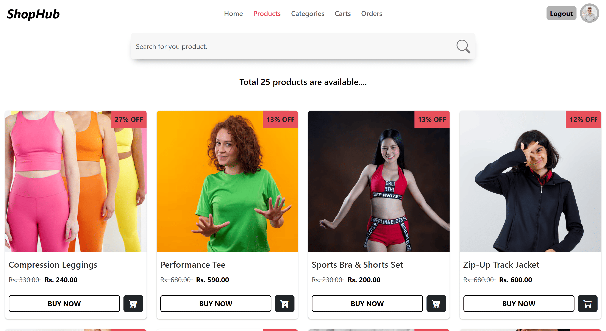
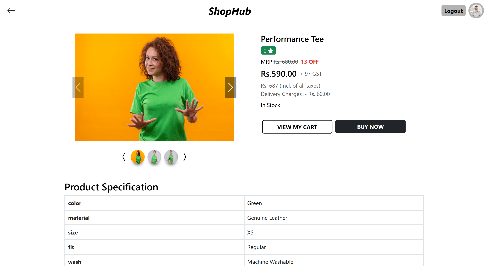
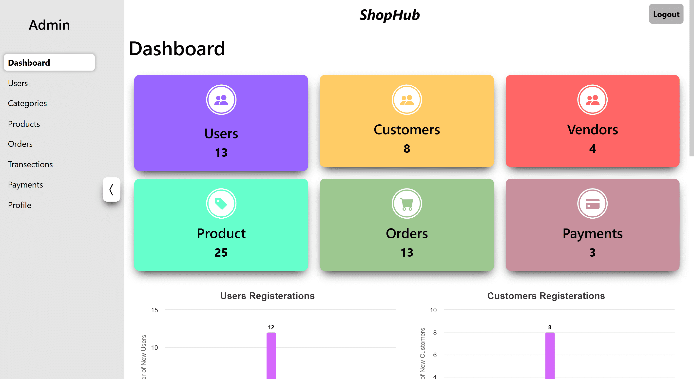
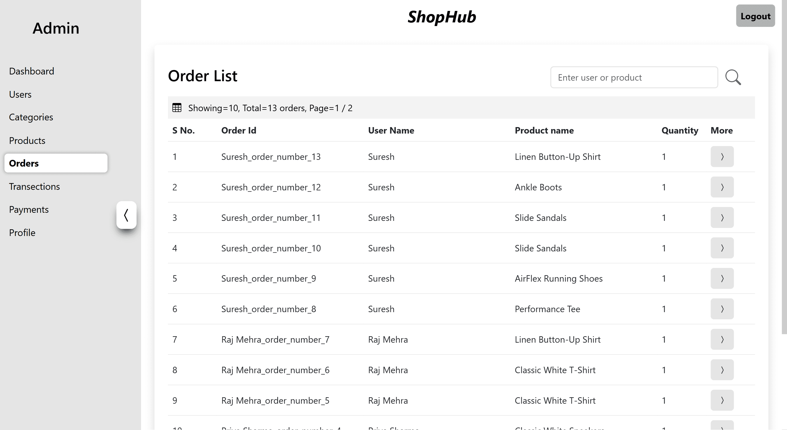
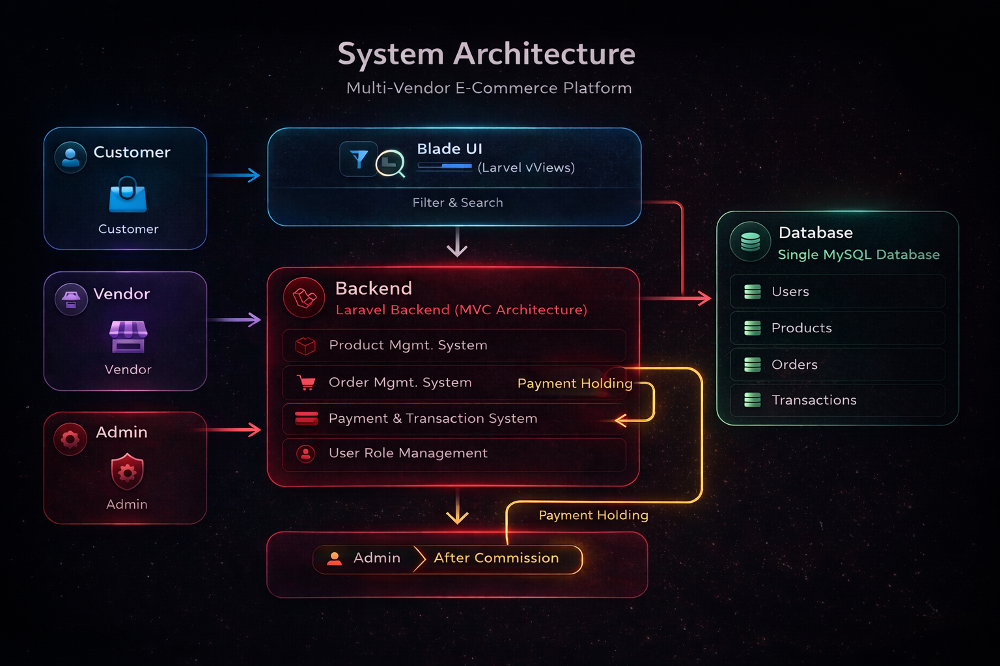

# ShopHub — Multi-Vendor E-Commerce Platform

ShopHub is a full-stack multi-vendor marketplace platform where customers can discover and purchase products, vendors can manage their stores and orders, and administrators can control platform operations, transactions, and marketplace activities.

The platform was designed to handle separate workflows for customers, vendors, and administrators within a centralized marketplace system while maintaining structured order management and transaction flow.

> Built independently as a complete end-to-end marketplace application.

---

## 🌐 Live Demo

🔗 Demo: https://shophub.zya.me

---

## 📸 Screenshots

### Platform Interface


### Product Browsing


### Product Details


### Vendor Dashboard


### Admin Dashboard


### Order Management


---

## 🧠 Architecture Diagram

<p align="center">
  
</p>

---

## 🚀 Features

### Customer Features
- Browse latest and featured products
- Explore products by categories
- Search products dynamically
- View detailed product information
- Add products to cart
- Place and manage orders
- Complete payments through integrated payment gateway

---

### Vendor Features
- Dedicated vendor dashboard
- Add and manage products
- Manage product inventory
- Process customer orders
- Track sales and transactions
- View payment and earning details

---

### Admin Features
- Manage customers and vendors
- Add and manage product categories
- Manage products across the platform
- Monitor and manage orders
- Track customer and vendor transactions
- Control marketplace operations and settlements

---

## 💳 Payment Workflow

The platform follows a centralized transaction model:

1. Customer places an order and completes payment
2. Payment is received by the platform administrator
3. Vendor processes and completes the order
4. Admin releases payment to vendor after deducting platform commission

This workflow helps maintain transaction control and structured vendor settlements.

---

## 🏗️ Project Overview

ShopHub was designed as a centralized marketplace system where multiple vendors can operate independently within a single platform.

The application supports:
- product discovery and purchasing for customers
- product and order management for vendors
- complete operational control for administrators

The system focuses on structured marketplace workflows, role-based access control, and scalable product management.

---

## 🧠 System Architecture

ShopHub follows a modular Laravel MVC architecture with clearly separated business logic, data handling, and presentation layers.

### Frontend
- Blade Templating Engine
- Bootstrap
- JavaScript

### Backend
- Laravel
- MVC Architecture
- Role-Based Middleware
- Eloquent ORM

### Database
- MySQL relational database

### Deployment
- cPanel Hosting Environment
- phpMyAdmin
- Environment-based configuration

---

## ⚙️ Tech Stack

### Frontend
- Blade
- Bootstrap
- JavaScript

### Backend
- Laravel
- PHP
- Eloquent ORM

### Database
- MySQL

### Infrastructure
- cPanel Hosting
- phpMyAdmin

---

## 🧩 Core Systems

### Marketplace System
- Multi-vendor product management
- Category-based product organization
- Product inventory management
- Structured marketplace workflows

---

### User Role System
- Customer role
- Vendor role
- Admin role
- Role-based access control

---

### Order & Transaction System
- Cart and checkout workflow
- Order lifecycle management
- Transaction tracking
- Vendor settlement management

---

### Vendor Management System
- Product management
- Inventory updates
- Order handling
- Sales tracking

---

### Admin Management System
- User management
- Product moderation
- Category management
- Order and transaction monitoring

---

### Product Search & Filtering
- Dynamic product search
- Category-based filtering
- Vendor-based filtering
- Optimized query handling

---

## 🧠 Technical Challenges Solved

### Managing Multi-Role Workflows
Implemented structured role-based middleware and isolated workflows for customers, vendors, and administrators.

### Designing Centralized Transaction Handling
Built a controlled payment workflow where the platform manages settlements between customers and vendors.

### Optimizing Product Search & Filtering
Implemented dynamic query handling using Eloquent ORM for scalable product discovery.

### Maintaining Relational Data Consistency
Designed normalized database relationships between users, products, orders, and transactions.

### Managing Marketplace Complexity
Structured application modules using Laravel MVC architecture for maintainability and scalability.

---

## 📁 Project Structure

```bash
multi-vendor-ecommerse/
├── app/
├── bootstrap/
├── config/
├── database/
├── public/
├── resources/
│   ├── views/
│   ├── js/
│   └── css/
├── routes/
├── storage/
└── tests/
```

---

## 🛠️ Installation

### Clone Repository

```bash
git clone https://github.com/thappamkkumar/multi-vendor-ecommerse.git
```

---

### Backend Setup

```bash
composer install
cp .env.example .env
php artisan key:generate
```

Configure database credentials in `.env`

Run migrations:

```bash
php artisan migrate
```

Start development server:

```bash
php artisan serve
```

---

### Frontend Setup

Install dependencies:

```bash
npm install
```

Compile frontend assets:

```bash
npm run dev
```

---

## 🔐 Authentication & Authorization

- Role-based authentication
- Protected routes and middleware
- Secure access control for each user role

---

## 📈 Engineering Highlights

- Independently built complete marketplace architecture
- Designed multi-role workflow system
- Implemented centralized payment handling
- Built scalable product search and filtering system
- Structured relational database architecture
- Managed deployment and hosting configuration
- Developed modular Laravel MVC application structure

---

## 📌 Future Improvements

- Real-time order updates
- Notification system
- Redis caching
- Advanced analytics dashboard
- Docker-based deployment
- Recommendation engine

---

## 👨‍💻 Author

Mukesh Kumar

- Portfolio: https://mukeshkumar.vercel.app/
- GitHub: https://github.com/thappamkkumar
